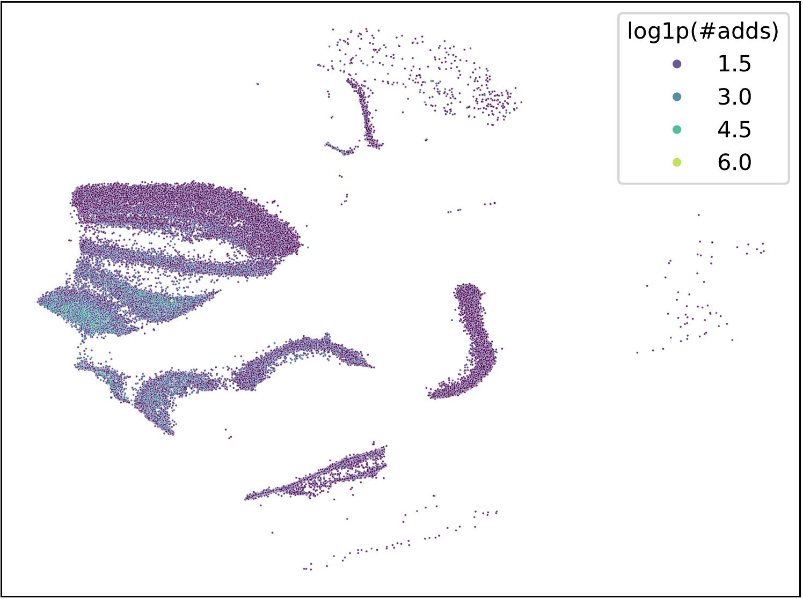
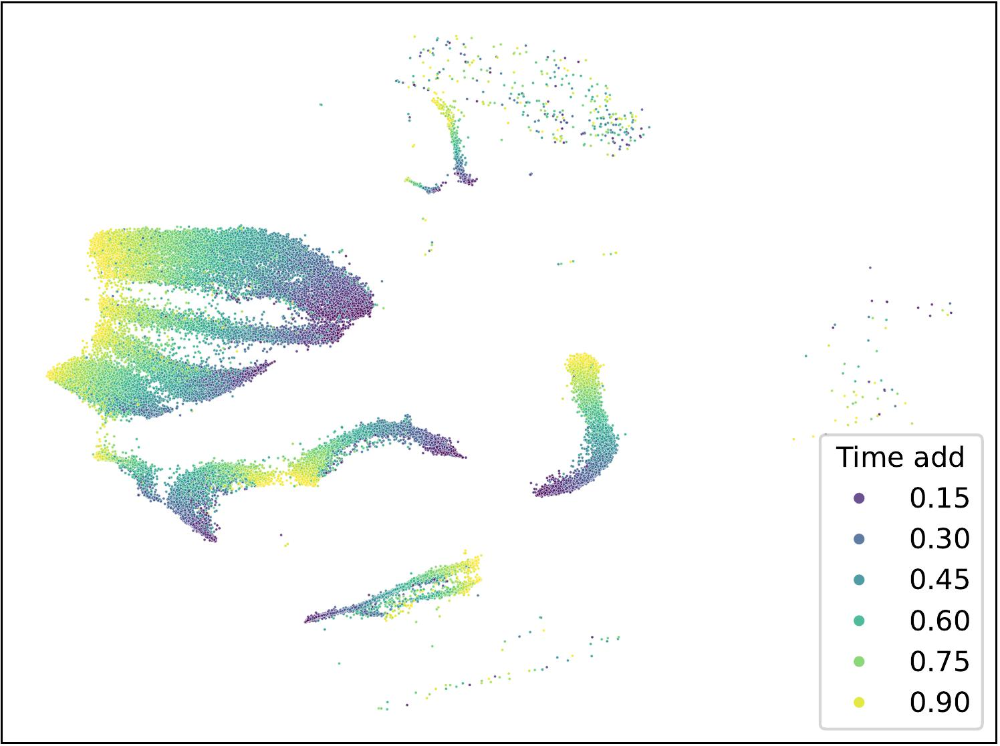

# Embeddings

## Number of the actions
The following images present the embeddings of users related to the number of actions each time. Users without activity of that type are excluded. Given the long tail on the number of actions, they were adjusted by computing the natural logarithm of the number of actions plus one. 

It can be observed that users with more actions tend to be placed in the centers of the clusters, but there is no clear separation. Moreover, the top cluster seems to be related to buying actions, as it seems to disappear in other actions. We can conclude something similar for the center cluster and the add action. 

## Time of the actions

The following images present the embeddings concerning the time of the actions. The time goes from zero to one, representing 23-06-2022 and 09-11-2022, respectively. The most likely time was computed as a weighted average of the points used for the KDE $$k_i$$ analysis and their corresponding point $$x_i$$. Basicaly $$action\_time=\frac{\sum_{i=1}^{11} k_ix_i}{\sum_{i=1}^{11} k_i}$$. Notice this computation is for each user.

Here, it can be observed that the embeddings capture well the time, as the colors are mostly separated. Notice that different clusters might be related to different actions. It is important to notice that not all clusters are related to all the activities, but there are some overlaps, which is to be expected as there is a correlation between the actions.

